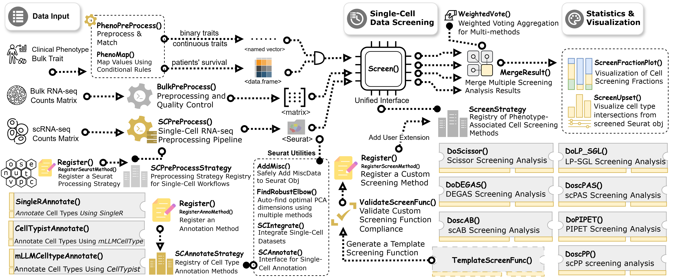

# **SigBridgeR** <a href="https://wanglabcsu.github.io/SigBridgeR/"></a>

[](https://lifecycle.r-lib.org/articles/stages.html#stable)
[](https://cran.r-project.org/web/licenses/GPL3)
[](https://github.com/WangLabCSU/SigBridgeR)
[](https://wanglabcsu.r-universe.dev/SigBridgeR)
[](https://github.com/WangLabCSU/SigBridgeR/actions)
[](https://wanglabcsu.r-universe.dev/)
[](https://deepwiki.com/WangLabCSU/SigBridgeR)
------------------------------------------------------------------------

## 🌐 Overview

SigBridgeR integrates multiple algorithms, using single-cell RNA
sequencing data, bulk expression data, and sample-related phenotypic
data, to identify the cells most closely associated with the phenotypic
data, performing as a bridge to existing tools.

<p align="center">



</p>


## 🔧 Installation

Usually we recommend installing the latest release from GitHub because
of the latest features and bug fixes.

1.  Install the development version from GitHub:

```r
if (!requireNamespace("pak")) {
  install.packages(
    "pak",
    repos = sprintf(
      "https://r-lib.github.io/p/pak/stable/%s/%s/%s",
      .Platform$pkgType,
      R.Version()$os,
      R.Version()$arch
    )
  )
}
pak::pkg_install("WangLabCSU/SigBridgeR")
```

<!-- 2.  Install from r-universe:

```r
install.packages("SigBridgeR", repos = "https://wanglabcsu.r-universe.dev")
``` -->

2.  Install with all dependencies:

```r
pak::pkg_install("WangLabCSU/SigBridgeR", dependencies = TRUE)
```

### It is recommended to install the following packages:

`SigBridgeR` includes the Scissor and scAB algorithms by default. In addition to these, installing the following packages allows you to use additional algorithms.

```r
methods <- c("scPAS", "scPP", "DEGAS", "LPSGL", "PIPET", "rSIDISH", "SCIPAC", "rTiRank")
pak::pkg_install(file.path("Exceret", methods))
```

<!-- **Community-Maintained Algorithms**：

These algorithms are maintained by the community.

```r

```
 -->


---

**unnecessary but recommended**:

<details>
<summary>For better performance:</summary>

```r
pak::pkg_install(c(
  # faster computation
  "sparseMatrixStats",
  "matrixStats",
  "preprocessCore",
  "tidyr",
  "matrixTests",
  "KernSmooth",
  "cheapr",
  # better gene symbol conversion
  "scCustomize",
  # parallel computation
  "furrr",
  "future"
))

if (!requireNamespace("BiocManager")) {
  install.packages("BiocManager")
}
# faster computation
BiocManager::install("WGCNA)
```

</details>

<details>
<summary>For seamless integration with single-cell RNA-seq data stored in `.h5ad`:</summary>

```r
pak::pkg_install("anndata")
# or
pak::pkg_install("anndataR") # both are supported
```

</details>

<details>
<summary>For visualization:</summary>

```r
pak::pkg_install(c(
 "ggplot2",
 "randomcoloR", # or RColorBrewer
 "ggupset", # for upset plot
 "patchwork", # for fraction stack plot
 "ggforce", # for pca plot
 "ggVennDiagram" # for venn diagram
))
```

</details>

<details>
<summary>To use the built-in cell annotation methods:</summary>

```r
pak::pkg_install(c(
  # SingleR
  "SingleR-inc/SingleR",
  "celldex",
  # mLLMCelltype
  "mLLMCelltype",
  "plyr",
  # CellTypist
  "reticulate",
  "AnnDataR"
))
```

</details>

<details>
<summary>To add custom extension functions to SigBridgeR:</summary>

```r
pak::pkg_install(c(
  "tictoc",
  "codetools",
  "knitr",
  "lintr",
  "rstudioapi",
  "yonicd/tidycheckUsage"
))
```

</details>

<details>
<summary>To reproduce the tutorial to learn more usage:</summary>

```r
pak::pkg_install(c(
  "zeallot",
  "here",
  "org.Hs.eg.db",
  "processx"
))
```

</details>


## 📓 Documentation

Get Started:

-   View [Github Webpage](https://wanglabcsu.github.io/SigBridgeR/)
-   [A Quick Started Guide](vignettes/Quick_Start.md)
-   [Start from spatial transcriptome](vignettes/Spatial_Transcriptome.md) 
-   [Full Tutorial](vignettes/Full_Tutorial.md) for more details
-   Use `?SigBridgeR::function_name` to access the help documents in R.

If you encounter problems, please check:

-   the [Troubleshooting Guide](vignettes/Troubleshooting.md), or
-   the [Github issues](https://github.com/WangLabCSU/SigBridgeR/issues)
    page if you want to file bug reports or feature requests

Let us know if you have ideas to make this project better. Pull requests are welcome!

<!-- ## 📚 Citation

```r
citation("SigBridgeR")
To cite package ‘SigBridgeR’ in publications use:

  Yang Y, Wang S (2026). _SigBridgeR: Integrative Toolkit for Linking Phenotypes to Cell Subpopulations via scRNA-seq and Bulk Data_. R
  package version 3.6.1, commit 7136cd81401da9ef95b752405c57323df865bed2, <https://github.com/WangLabCSU/SigBridgeR>.

A BibTeX entry for LaTeX users is

  @Manual{,
    title = {SigBridgeR: Integrative Toolkit for Linking Phenotypes to Cell
Subpopulations via scRNA-seq and Bulk Data},
    author = {Yuxi Yang and Shixiang Wang},
    year = {2026},
    note = {R package version 3.6.1, commit 7136cd81401da9ef95b752405c57323df865bed2},
    url = {https://github.com/WangLabCSU/SigBridgeR},
  }
```

```text

``` -->


## 🗺️ Similar Projects

[scSurvival](https://github.com/cliffren/scSurvival): Single-cell data (log-normalized + HVG-selected) + survival data (optional clinical covariates and batch labels) -> Survival-associated cell subpopulations

[CellPhenoX](https://github.com/fanzhanglab/pyCellPhenoX): Single-cell multi-omics data + bulk-level clinical variables, covariates (optional interaction effect terms) -> interpretable score per cell

[scPrognosis](https://github.com/XiaomeiLi1/scPrognosis): scRNA-seq data (imputed by MAGIC + filtered for low coverage/expression) + bulk RNA-seq expression matrix (with matched survival time and event status) -> breast cancer prognostic gene signatures and Cox PH risk prediction model

[SCellBOW](https://github.com/cellsemantics/SCellBOW): source scRNA-seq data + target scRNA-seq data + (optional) bulk RNA-seq data with paired survival data -> cell embeddings, cluster assignments, UMAP visualizations, and phenotype‑algebra‑derived risk scores with survival probability curves for individual cell subpopulations.

[scPER](https://github.com/BrianLlll/scPER): Single-cell RNA-seq data + bulk RNA-seq data + celltype annotation (optional batch labels) -> phenotype-associated cell populations

[scSurv](https://github.com/3254c/scSurv): scRNA-seq data + bulk RNA-seq expression matrix (with matched survival time and event status) -> per-cell hazard scores and prognostic gene sets