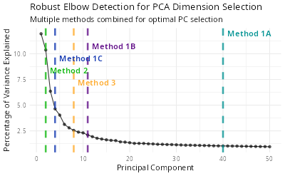

# Auxiliary Utils

This document introduces several auxiliary functions of SigBridgeR.

## Setting

### Setting and Retriving Package Options

Currently, 3 package options are provided:

- `verbose`: Whether to print the progress of the function. Default is
  `TRUE`.
- `seed`: The random seed used in the function. Default is `123L`.
- `timeout`: The maximum timeout time when downloading data. Default is
  `180L`.

These options can be modified using either the `setFuncOption` or
`Options` function (the former is recommended).

``` r
setFuncOption(seed = 321L)

options(SigBridgeR.seed = 321L)
```

`setFuncOption` automatically detects the prefix, so parameters with a
package name prefix are also compatible.

``` r
setFuncOption(SigBridgeR.seed = 321L)
```

`getFuncOption` is used to retrieve the global parameters of SigBridgeR.

``` r
getFuncOption("seed")
# 321

# * Auto-detect prefix 
getFuncOption("SigBridgeR.seed")
# 321
```

### Setting Threads

Used to control the number of threads for OpenMP and data.table. By
default, uses half of the maximum available threads.

Default:

``` r
setThreads(
  n_threads = NULL,
  backend = c("openmp", "dt")
)
```

Example Usage:

``` r
setThreads(1L)
```

``` r
# ── System Threads Config ───────────────────────────────────────────────────────────────────────────────────────────────────
#   OpenMP version (_OPENMP)       201511
#   omp_get_num_procs()            192
#   R_DATATABLE_NUM_PROCS_PERCENT  unset (default 50)
#   R_DATATABLE_NUM_THREADS        unset
#   R_DATATABLE_THROTTLE           unset (default 1024)
#   omp_get_thread_limit()         2147483647
#   omp_get_max_threads()          192
#   OMP_THREAD_LIMIT               unset
#   OMP_NUM_THREADS                1
#   RestoreAfterFork               true
#   data.table is using 1 threads with throttle==1024. See ?setDTthreads.

# ── Changes 
# • "OMP_NUM_THREADS": 1 -> 1
# • "data.table": 96 -> 1
```

## Seurat Utilities

### Find the Optimal Normalization Method for Seurat

A simple scoring function for selecting a normalization method.

Evaluates 3 dimensions of preprocessing quality:

- **Variance stabilization**: Decoupling of mean-variance relationship
  in normalized expression (lower correlation = better).

- **Biological signal retention**: Preservation of known marker genes
  within highly variable genes (higher retention = better).

- **Dropout robustness**: Removal of technical dropout bias from
  normalized values (lower correlation with dropout rate = better).

Exmaple Usage:

``` r
obj <- Seurat::CreateSeuratObject(counts)

sct <- Seurat::SCTransfrom(obj)
lognorm <- Seurat::NormalizeData(obj) %>%
    Seurat::ScaleData() %>%
    Seurat::FindVariableFeatures()

ChooseNormalization(
  sct = sct,
  lognorm = lognorm, 
  # * More can be added here
  subset_size = integer(),
  known_hvgs = list(),
  n_hvgs = 2000L,
  low_expressed_thresh = 0.2,
  weight = c(
    variance_stability = 0.4,
    marker_signal = 0.35,
    dropout_robustness = 0.25
  )
) 
```

``` r
# ℹ Using 1088 cells
# ℹ Comparing 2 methods: sct and lognorm
# ── Method Ranking (Composite Score) 
# Top method: log_norm
# [1] log_norm: 0.825
# [2] sctransform: 0.175
```

Supports simultaneously adding Seurat objects preprocessed with multiple
methods, ensuring they are equivalent to the standard workflow of
`NormalizeData` + `ScaleData` + `FindVariableFeatures`.

#### Parameters

- `subset_size`: Size of the single-cell data subset (i.e., number of
  cells) to be evaludated.
- `known_hvgs`: list or character. Known highly variable genes, provided
  as a reference baseline.
- `n_hvgs`: Maximum number of highly variable genes to consider.
- `low_expressed_thresh`: Percentage of genes excluded from
  consideration, ranked by expression level.
- `weight`: Scoring weight that sum to 1.

### Finding the Optimal Number of Principle Components

Usually the number if principle components (PCs) is manually set to 10
or 20 according to the elbow plot. However, it is not always the case
that the PCs with the highest variance are the most informative. Here is
a function to help you find the optimal number of PCs.

``` r
ndims <- FindRobustElbow(
  obj = seurat,
  verbose = TRUE,
  ndims = 50 
)
# ── Method Results 
# ℹ Method 1A (Cumulative Variance > 90%): 1:40
# ℹ Method 1B (Variance > Mean): 1:11
# ℹ Method 1C (Variance > 2*SD): 1:4
# ℹ Method 2 (Second Derivative): 1:2
# ℹ Method 3 (Distance-based): 1:8
# ✔ Final Recommended Dimensions:  1:35

# ── Summary 
# ℹ Cumulative variance at 35 PCs: 84.8%
# ℹ Variance explained by PC35: 1.09%

print(ndims)
# 35
```

This function will draw an elbow plot with each method and the
recommended number of PCs. You can also use the `ndims` parameter to
specify the maximum number of PCs to be tested. The default value is
`50`.

``` r
knitr::include_graphics("vignettes/example_figures/elbow.png")
```

[](NA)

### Add miscellaneous information to the Seurat object

SigBridgeR uses
[`AddMisc()`](https://wanglabcsu.github.io/sigbridger/reference/AddMisc.md)
to record what data features or evidence the various screening
algorithms are based on during execution. As a substitute for the
[`SeuratObject::Misc()`](https://satijalab.github.io/seurat-object/reference/Misc.html)

- [`AddMisc()`](https://wanglabcsu.github.io/sigbridger/reference/AddMisc.md)
  : Add miscellaneous information to the Seurat object. Support for
  adding multiple attributes to the `SeuratObject@misc` slot
  simultaneously.

``` r
# basic usage
seurat_obj <- AddMisc(seurat_obj, "QC_stats" = qc_df)

# Auto-incrementing example when `cover` set to FALSE
seurat_obj <- AddMisc(seurat_obj, markers = markers1)
seurat_obj <- AddMisc(seurat_obj, markers = markers2, cover=FALSE)

# Add multiple attributes to the `SeuratObject@misc` slot simultaneously
seurat_obj <- AddMisc(seurat_obj, markers1 = markers1, markers2 = markers2)

# Add multiple attributes (stored as a list element) to the `SeuratObject@misc`
seurat_obj <- AddMisc(seurat_obj, list(attr1 = "value1", attr2 = "value2"))
```

### Add Gene-level Metadata to the Seurat object

SigBridgeR uses
[`AddMetaFeature()`](https://wanglabcsu.github.io/sigbridger/reference/AddMetaFeature.md)
to update the `SeuratObject@assays$RNA@meta.data`

Add a new column to the metadata

``` r
gene_type <- rep("test", nrow(seurat_obj))

seurat_obj <- AddMetaFeature(seurat_obj, "gene_type" = gene_type)
```

Add a data.frame to the metadata, with the column names as the metadata
names.

``` r
seurat_obj <- AddMetaFeature(
  seurat_obj,
  data.frame(gene_type = gene_type, gene_name = rownames(seurat_obj)
)
```

Add to different assays

``` r
seurat_obj <- AddMetaFeature(seurat_obj, "gene_type" = gene_type, assay = "RNA")
seurat_obj <- AddMetaFeature(seurat_obj, "gene_type" = gene_type, assay = "ATAC")
```

If duplicate column names are detected, they will be suffixed with an
underscore and a number (e.g., `_1`, `_2`) for disambiguation.

### Integration of Single Cell Data

#### Matrix Integration

When passing raw matrices, the function performs a “join” operation
based on the union of all genes. Missing values are filled with NA.

``` r
# Create dummy matrices
mat1 <- matrix(rpois(50, 5), nrow = 10, dimnames = list(paste0("G", 1:10), paste0("C", 1:5)))
mat2 <- matrix(rpois(60, 6), nrow = 10, dimnames = list(paste0("G", 5:14), paste0("C", 1:6)))

# Integrate matrices with custom prefixes
integrated_mat <- SCIntegrate(BatchA = mat1, BatchB = mat2)
# default prefixed
integrated_mat2 <- SCIntegrate(mat1, mat2)
```

``` r
integrated_mat[1:6, 1:4]
#     BatchA_C1 BatchA_C2 BatchA_C3 BatchA_C4
# G1          3         2         4         5
# G10         2         4         3         4
# G11        NA        NA        NA        NA
# G12        NA        NA        NA        NA
# G13        NA        NA        NA        NA
# G14        NA        NA        NA        NA
integrated_mat2[1:6, 1:4]
#     mat1_C1 mat1_C2 mat1_C3 mat1_C4
# G1        3       2       4       5
# G10       2       4       3       4
# G11      NA      NA      NA      NA
# G12      NA      NA      NA      NA
# G13      NA      NA      NA      NA
# G14      NA      NA      NA      NA
```

Key Features:

- Duplicate Resolution: Automatically calls `AggregateDups` to handle
  redundant gene symbols.

- Auto-Naming: Uses argument names (like BatchA) as cell ID prefixes.

#### Seurat Integration

For Seurat objects, `SCIntegrate` automates the standard workflow via
the pipeline parameter.

The Pipeline String: Each letter in the pipeline argument triggers a
specific Seurat command:

| Code  | Function               | Description                         |
|-------|------------------------|-------------------------------------|
| **o** | `CreateSeuratObject`   | (do not use it in this function)    |
| **n** | `NormalizeData`        | Standard normalization.             |
| **s** | `ScaleData`            | Scales data for PCA.                |
| **v** | `FindVariableFeatures` | Selects highly variable genes.      |
| **p** | `RunPCA`               | Principal Component Analysis.       |
| **e** | `FindNeighbors`        | Computes SNN graph.                 |
| **c** | `FindClusters`         | Louvain algorithm clustering.       |
| **t** | `RunTSNE`              | t-SNE reduction.                    |
| **u** | `RunUMAP`              | UMAP reduction.                     |
| **r** | `SCTransform`          | **SCT workflow.** Replaces n, s, v. |

If more are needed, see [A Guide for Custom
Extensions](https://wanglabcsu.github.io/SigBridgeR/articles/Extending.html)

Example Usage

``` r
integrated <- SCIntegrate(
  obj1, obj2, # -> merge.Seurat
  pipeline = "nsvpi",
  method = Seurat::RPCAIntegration, # Change integration method
  dims = 1:30,                      # Passed to RunPCA and IntegrateLayers
  k.weight = 50                     # Passed to IntegrateLayers
)
```

An example using mock data

``` r
mat1 <- matrix(
  rpois(1000, 5),
  nrow = 20,
  dimnames = list(paste0("G", 1:20), paste0("C", 1:50))
)
mat2 <- matrix(
  rpois(1200, 6),
  nrow = 20,
  dimnames = list(paste0("G", 11:30), paste0("C", 1:60))
)

seu1 <- Seurat::CreateSeuratObject(mat1)
seu2 <- Seurat::CreateSeuratObject(mat2)
integrated_seu <- SCIntegrate(
  Seurat1 = seu1, # Add prefixes
  Seurat2 = seu2,
  method = Seurat::CCAIntegration,
  pipeline = "nsvpi",
  dims = 1:10,
  k.weight = 40
)
```

``` r
integrated_seu
# An object of class Seurat 
# 30 features across 110 samples within 1 assay 
# Active assay: RNA (30 features, 10 variable features)
#  5 layers present: counts.1, counts.2, data.1, data.2, scale.data
#  2 dimensional reductions calculated: pca, integrated.dr
```

## Cell Type Annotation

As of version 3.3.0, three built-in cell annotation algorithms are
included and can be applied directly to Seurat objects. Using them
requires installing additional dependencies. See the
[README](https://wanglabcsu.github.io/SigBridgeR/index.html).

Basic usage:

``` r
seurat <- SCAnnotate(
  sc = seurat,
  method = c("CellTypist", "SingleR", "mLLMCelltype")
  # * more arguments passed to each method
)
```

`SCAnnotate` will automatically set up the required dependencies for you
(making it even more plug-and-play). If the `method` argument is not
specified, it will automatically select the appropriate annotation
method based on the provided arguments.

To control it manually, use following functions:

### CellTypist Annotation

This is the direct R wrapper of celltypist.annotate. Unlike
`SCAnnotate`, it does not prepare an environment for you.

``` r
seurat <- CellTypistAnnotate(
  sc,
  model = NULL,
  download = TRUE,
  conda = NULL,
  python = NULL,
  verbose = getFuncOption("verbose"), # TRUE
  celltypist_tools = system.file(
    "python/73-CellTypistAnnotate.py",
    package = "SigBridgeR"
  ),
  # * more arguments pass to celltypist.annotate (python)
) 
```

**Parameters**:

- `sc`: A Seurat object.
- `model`: Charater/str. The model to use. If `NULL`, the default model
  will be used.
- `download`: Logical/bool. Whether to download the model. Defaults to
  `TRUE`-download all models. if model already exists, skip download.
- `force_update`: Logical. Whether to force update the model file.
- `conda`: Character/str. conda environment name. If `NULL`, try to use
  `python`.
- `python`: Character/str. The path to the python executable. If `NULL`,
  try to use `conda`.
- `verbose`: Logical/bool. Whether to print verbose messages. Defaults
  to `TRUE`.
- `celltypist_tools`: The path to the celltypist_tools.py file. If
  `NULL`, the default path will be used.

**Returns**:

A Seurat object with the cell type annotation added as metadata columns.

Other parameters supported by `celltypist.annotate` will be
automatically passed through and can be directly supplied to
`CellTypistAnnotate`.

helpful link: <https://github.com/Teichlab/celltypist>

### mLLMCelltype Annotation

``` r
seurat <- mLLMCellTypeAnnotate(
  sc,
  seurat_obj_markers = NULL,
  # * Context for large language models
  tissue_name = "Human Cancer", 
  models = c(
    "gpt-5",
    "claude-sonnet-4-5-20250929",
    "gemini-3-pro",
    "qwen-max-2025-01-25"
  ),
  api_keys = list(
    anthropic = "your-anthropic-key",
    openai = "your-openai-key",
    gemini = "your-google-key",
    qwen = "your-qwen-key"
  ),
  # Other arguments passed to `mLLMCelltype::annotate_cell_types` or ` mLLMCelltype::interactive_consensus_annotation`
)
```

**Parameters**

- `sc` : A Seurat object with pre-computed clusters (stored in
  `Idents(sc)` or `sc$seurat_clusters`).

- `seurat_obj_markers` : Optional pre-computed marker gene table or list
  (output of
  [`Seurat::FindAllMarkers()`](https://satijalab.org/seurat/reference/FindAllMarkers.html)).
  If `NULL` (default), markers are computed automatically using
  parameters passed via `...`.

- `tissue_name` : Character. Biological context for annotation (e.g.,
  tissue type, disease state). Helps LLMs interpret marker genes
  appropriately. Default: `"Human Tumor"`.

- `models` : Character vector of LLM model identifiers. Supported
  formats:

  - OpenAI: `"gpt-4o"`, `"gpt-4o-mini"`, etc.
  - Anthropic: `"claude-3-5-sonnet-20240620"`, etc.
  - Google: `"gemini-1.5-pro"`, etc.
  - Alibaba: `"qwen-max"`, `"qwen-plus"`, etc.

  Default:
  `c("gpt-4o", "claude-3-5-sonnet-20240620", "gemini-1.5-pro", "qwen-max")`.
  For single-model mode, only the first model is used.

- `api_keys` : Named list of API keys with provider names as keys:

  - `openai`: OpenAI API key
  - `anthropic`: Anthropic API key
  - `gemini`: Google Cloud API key (with Gemini enabled)
  - `qwen`: Alibaba DashScope API key

  Example: `list(openai = "sk-...", anthropic = "sk-ant-...")`.

  **Note**: Default placeholder keys (`"your-xxx-key"`) will fail—users
  must supply valid keys.

**Returns**:

A Seurat object with the cell type annotation added as metadata columns.

helpful link: <https://github.com/cafferychen777/mLLMCelltype>

### SingleR Annotation

``` r
seurat <- SingleRAnnotate(
  sc,
  verbose = getFuncOption("verbose"), # TRUE
  # * pass to `celldex::HumanPrimaryCellAtlasData`
  ensembl = FALSE,
  cell.ont = c("all", "nonna", "none"),
  legacy = FALSE,
  # * pass to `SingleR::SingleR`
  ref = c("HPCA", "custom"),
  labels = NULL,
  # Other arguments passed to `SingleR::SingleR`
)
```

**Parameters**

- `sc`: A Seurat object.
- `verbose`: Logical. Whether to print progress messages. Defaults to
  `TRUE`.
- `ensembl`: Logical. Whether to convert row names to Ensembl IDs. Genes
  without a valid mapping are discarded.
- `cell.ont`: Character. specifying Cell Ontology term handling. Use
  `"nonna"` to discard samples without valid terms, `"all"` to keep all
  samples (with possible `NA`), or `"none"` to skip.
- `legacy`: Logical. Whether to use legacy ExperimentHub backend.
  Default uses gypsum.
- `ref`: Reference data for annotation. Either `"HPCA"` (Human Primary
  Cell Atlas from `celldex`) or a `SingleCellExperiment` object with
  pre-labeled cells. For multiple references, a list of matrices or
  `SummarizedExperiment` objects.
- `labels`: Character vector of cell type labels for `ref` columns.
  Required for custom references; defaults to `ref$label.main` for
  `"HPCA"`. If `ref` is a list, `labels` must be a corresponding list.

**Returns**:

A Seurat object with the cell type annotation added as metadata columns.

helpful link: <https://github.com/SingleR-inc/SingleR>

## Other Functions

### Load reference data

**Parameters**

- `data_type`: The type of data to load. Can be either “continuous”,
  “survival” or “binary”, case-insensitive.
- `path`: The path to the data directory.
- `cache`: Whether to cache the data. Defaults to `TRUE`.
- `timeout`: The maximum timeout time when downloading data.

When loading the example data, the single-cell RNA expression matrix,
the bulk RNA expression matrix, and the clinical phenotype data are
loaded all at once. These data are combined into a list and returned.

``` r
mydata <- LoadRefData(
    data_type = c("survival"),
    path = tempdir(),
    cache = TRUE,
    timeout = 60
)

# * mat_exam (matrix_example)
mydata[[1]][1:6,1:6]
#          SMC01.T_AAACCTGCATACGCCG SMC01.T_AAACCTGGTCGCATAT SMC01.T_AAACCTGTCCCTTGCA SMC01.T_AAACGGGAGGGAAACA SMC01.T_AAACGGGGTATAGGTA SMC01.T_AAAGATGAGGCCGAAT
# A1BG                            0                        0                        0                        0                        0                        0
# A1BG.AS1                        0                        0                        0                        0                        0                        0
# A1CF                            0                        2                        0                        0                        3                        0
# A2M                             0                        0                        0                        0                        0                        0
# A2M.AS1                         0                        0                        0                        0                        0                        0
# A2ML1                           0                        0                        0                        0                        0                        0

# * bulk_survival
mydata[[2]][1:6,1:6]
#         TCGA-69-7978 TCGA-62-8399 TCGA-78-7539 TCGA-73-4658 TCGA-44-6775 TCGA-44-2655
# HIF3A         4.2598      11.6239       9.1362       5.0288       4.0573       5.5335
# RTN4RL2       8.2023       5.5819       3.5365       7.4156       7.7107       5.3257
# HMGCLL1       2.7476       5.8513       3.8334       3.6447       2.9188       4.8820
# LRRTM1        0.0000       0.4628       4.7506       6.8005       7.7819       2.2882
# GRIN1         6.6074       5.4257       4.9563       7.3510       3.5361       3.3311
# LRRTM3        1.7458       2.0092       0.0000       1.4468       0.0000       0.0000

# * pheno_survival
mydata[[3]] |> head()
#               time status
# TCGA-69-7978  4.40      0
# TCGA-62-8399 88.57      0
# TCGA-78-7539 25.99      0
# TCGA-73-4658 52.56      1
# TCGA-44-6775 23.16      0
# TCGA-44-2655 43.50      0
```

We recommend using the `zeallot` package’s `%<-%` function to assign
values and rename them simultaneously.

``` r
library(zeallot)

c(mat_exam, bulk, pheno) %<-%  LoadRefData(
    data_type = c("survival"),
    path = tempdir(),
    cache = TRUE,
    timeout = 60
)
```

## Setting up Python Environment

Some screening methods (e.g. [Section 3.5
DEGAS](#id_35-option-e-degas-screening)) are built using Python and
require an execution environment. Here is a function to help you set up
a Python environment. Both Windows and Unix-like systems are supported.

``` r
# * This is an example of setting up a Python environment using conda
SetupPyEnv(
    env_type = "conda",
    env_name = "test-condaenv",
    method = c("reticulate", "system","environment"), # choose one of them, default is "reticulate"
    env_file = NULL # path to environment.yml file, used when method = "environment"
    python_version = NULL,
    packages = c(
        "pandas" = "1.3",
        "numpy" = "any"
    ),
    recreate = FALSE, # whether to remove the existing environment and recreate it
    use_conda_forge = TRUE,
    verbose = TRUE
) 

reticualte::use_condaenv("test-condaenv")
```

``` r
# * Or use virtualenv via reticulate
SetupPyEnv(
    env_type = "venv", 
    env_name = "test-venv", 
    python_version = "3.9.15",
    packages = c("tensorflow" = "2.4.1", "protobuf" = "3.20.3"),
    python_path = NULL,
    recreate = FALSE,
    verbose = TRUE
)

reticulate::use_virtualenv("test-venv")
```

You can use
[`ListPyEnv()`](https://wanglabcsu.github.io/sigbridger/reference/ListPyEnv.md)
to list all the Python environments you have set up. Both conda and
virtual environments are supported.

``` r
# * Unix-like systems
ListPyEnv()
#                 name                                                  python  type
# 1               base                        /home/user/miniconda3/bin/python conda
# 2      test-condaenv     /home/user/miniconda3/envs/test-condaenv/bin/python conda
# 3          test-venv         /home/user/miniconda3/envs/test-venv/bin/python  venv
```

Show the conda environments only:

``` r
# * Unix-like systems
ListPyEnv(env_type = "conda")
#                 name                                                  python  type
# 1               base                        /home/user/miniconda3/bin/python conda
# 2      test-condaenv     /home/user/miniconda3/envs/test-condaenv/bin/python conda
```

If the virtual environment isn’t installed in the default location, you
can specify the location of the virtual environment with the
`venv_locations` parameter.

``` r
ListPyEnv(env_type = "venv", venv_locations ="~/here_is_a_dir/.virtualenvs")
```
