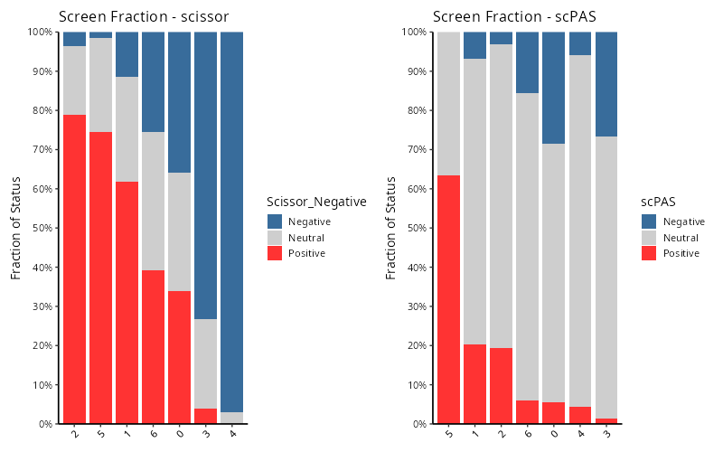
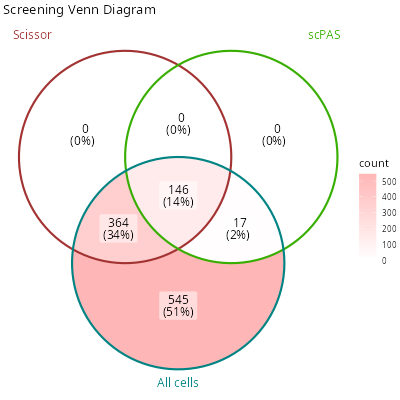
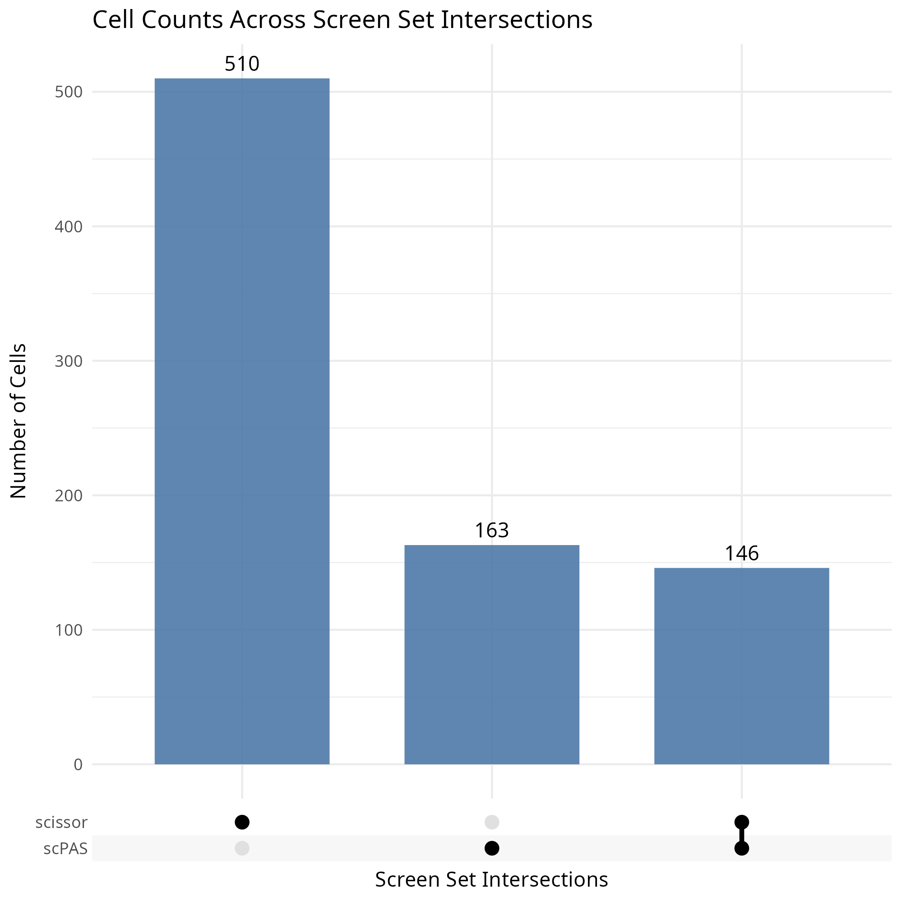
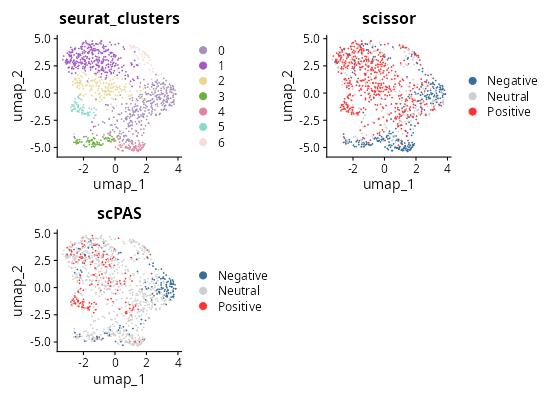

# Quick Start Guide for SigBridgeR

## Quick Start Guide for SigBridgeR

``` r
if (!requireNamespace("remotes")) {
  install.packages("remotes")
}
remotes::install_github("WangLabCSU/SigBridgeR")


# # Or install from r-universe:
# install.packages("SigBridgeR", repos = "https://wanglabcsu.r-universe.dev")

library(SigBridgeR)
library(Seurat)
```

We will start with a simple example.

``` r
if (requireNamespace("here", quietly = TRUE)) {
  setwd(here::here())
  knitr::opts_knit$set(root.dir = here::here())
}
```

``` r
library(zeallot) # %<-%
c(mat_exam, bulk_bi, pheno_bi) %<-% LoadRefData(data_type = "binary")
```

`mat_exam` is a single-cell RNA expression matrix, `bulk_bi` is a bulk
tissue RNA expression matrix, and `pheno_bi` is the phenotypic data
associated with `bulk_bi`. When using a binary or continuous phenotype,
the reference phenotype data is a **named vector**.

``` r
head(pheno_bi)
# TCGA-CA-5256-01 TCGA-AZ-6599-01 TCGA-AA-3655-01 TCGA-A6-6137-01 TCGA-CK-4952-01 TCGA-A6-5657-01
#               1               1               1               1               1               1
```

By the way, when using patients’ survival data as phenotype, the
reference data is a **data.frame**.

``` r
pheno_sur <- LoadRefData(data_type = "survival")[[3]]
head(pheno_sur)
#               time status
# TCGA-69-7978  4.40      0
# TCGA-62-8399 88.57      0
# TCGA-78-7539 25.99      0
# TCGA-73-4658 52.56      1
# TCGA-44-6775 23.16      0
# TCGA-44-2655 43.50      0
```

The single-cell RNA expression matrix needs to be processed into a
Seurat object. We set `scale.features` to all genes in order to maximize
the flexibility of downstream analyses and capture a broader range of
biological signals, so as to avoid insignificant results caused by too
small a dataset.

``` r
seurat_obj <- SCPreProcess(
  mat_exam,
  params = list(
    s = list(
      scale.feature = rownames(mat_exam)
    )
  )
)
```

Then we can use these data to screen out phenotype-assoicated cells.
Let’s start by trying **Scissor**.

``` r
scissor_res <- Screen(
  bulk_bi,
  seurat_obj,
  pheno_bi,
  phenotype_class = "binary",
  screen_method = "Scissor",
  alpha = 0.05
)
```

Other screening methods are also available.

``` r
scpas_res <- Screen(
  bulk_bi,
  seurat_obj,
  pheno_bi,
  phenotype_class = "binary",
  screen_method = "scPAS",
  alpha = 0.05
)
```

Since the screening is performed on the same data, we merge them.

``` r
merged_seurat <- MergeResult(
  scissor_res,
  scpas_res
)
```

Finally, we visualize the screening results.

- stacked bar plot:

``` r
fraction <- ScreenFractionPlot(
  merged_seurat,
  group_by = "seurat_clusters",
  screen_type = c("scissor", "scPAS")
)

# names(fraction)
# [1] "stats"         "plot"          "combined_plot"
```

``` r
knitr::include_graphics("vignettes/example_figures/fraction_q.png")
```

[](https://github.com/WangLabCSU/SigBridgeR/blob/main/vignettes/example_figures/fraction_q.png)

- Venn diagram:

``` r
c(scissor_pos, scpas_pos) %<-%
  purrr::map(
    c("scissor", "scPAS"),
    ~ colnames(merged_seurat)[
      which(merged_seurat[[.x]] == "Positive")
    ]
  )

all_cells <- colnames(seurat_obj)

pos_venn <- list(
  scissor = scissor_pos,
  scpas = scpas_pos,
  all_cells = all_cells
)

set.seed(123)

venn_plot <- ggVennDiagram::ggVennDiagram(
  x = pos_venn,
  # * the labels of each group to be shown on the diagram
  category.names = c(
    "Scissor",
    "scPAS",
    "All cells"
  ),
  # * the colors of each group
  set_color = c(
    "#a33333ff",
    "#37ae00ff",
    "#008383ff"
  ),
  label_geom = c("text")
) +
  ggplot2::scale_fill_gradient(low = "white", high = "#ffb6b6ff") +
  ggplot2::ggtitle("Screening Venn Diagram")
```

``` r
knitr::include_graphics("vignettes/example_figures/venn_q.png")
```

[](NA)

- Set plot:

``` r
upset <- ScreenUpset(
  merged_seurat,
  screen_type = c("scissor", "scPAS")
)
```

``` r
knitr::include_graphics("vignettes/example_figures/upset_q.png")
```

[](NA)

- 2D UMAP:

``` r
library(patchwork)
library(randomcoloR)

c(
  scissor_umap,
  scpas_umap
) %<-%
  purrr::map(
    c("scissor", "scPAS"),
    ~ Seurat::DimPlot(
      merged_seurat,
      group.by = .x,
      pt.size = 0.1,
      reduction = "umap",
      cols = c(
        "Neutral" = "#CECECE",
        "Positive" = "#ff3333",
        "Negative" = "#386c9b"
      )
    ) +
      ggplot2::ggtitle(.x)
  )

set.seed(123)
cols = randomcoloR::distinctColorPalette(
  length(unique(merged_seurat$seurat_clusters)),
  runTsne = TRUE
)

cluster_umap <- Seurat::DimPlot(
  merged_seurat,
  group.by = "seurat_clusters",
  pt.size = 0.1,
  reduction = "umap",
  cols = cols
) +
  ggplot2::ggtitle("seurat_clusters")


# * Show
umaps <- cluster_umap +
  scissor_umap +
  scpas_umap +
  plot_layout(ncol = 2)

umaps
```

``` r
knitr::include_graphics("vignettes/example_figures/umaps_q.png")
```

[](https://github.com/WangLabCSU/SigBridgeR/blob/main/vignettes/example_figures/umaps_q.png)

For more detail, please see [Full
Tutorial](https://wanglabcsu.github.io/SigBridgeR/articles/Full_Tutorial.html).

Session information:

``` r
sessionInfo()
```

    ## R version 4.5.2 (2025-10-31)
    ## Platform: x86_64-pc-linux-gnu
    ## Running under: Ubuntu 24.04.3 LTS
    ## 
    ## Matrix products: default
    ## BLAS:   /usr/lib/x86_64-linux-gnu/openblas-pthread/libblas.so.3 
    ## LAPACK: /usr/lib/x86_64-linux-gnu/openblas-pthread/libopenblasp-r0.3.26.so;  LAPACK version 3.12.0
    ## 
    ## locale:
    ##  [1] LC_CTYPE=C.UTF-8       LC_NUMERIC=C           LC_TIME=C.UTF-8       
    ##  [4] LC_COLLATE=C.UTF-8     LC_MONETARY=C.UTF-8    LC_MESSAGES=C.UTF-8   
    ##  [7] LC_PAPER=C.UTF-8       LC_NAME=C              LC_ADDRESS=C          
    ## [10] LC_TELEPHONE=C         LC_MEASUREMENT=C.UTF-8 LC_IDENTIFICATION=C   
    ## 
    ## time zone: UTC
    ## tzcode source: system (glibc)
    ## 
    ## attached base packages:
    ## [1] stats     graphics  grDevices utils     datasets  methods   base     
    ## 
    ## loaded via a namespace (and not attached):
    ##  [1] digest_0.6.39     desc_1.4.3        R6_2.6.1          fastmap_1.2.0    
    ##  [5] xfun_0.55         cachem_1.1.0      knitr_1.51        htmltools_0.5.9  
    ##  [9] rmarkdown_2.30    lifecycle_1.0.5   cli_3.6.5         sass_0.4.10      
    ## [13] pkgdown_2.2.0     textshaping_1.0.4 jquerylib_0.1.4   systemfonts_1.3.1
    ## [17] compiler_4.5.2    tools_4.5.2       ragg_1.5.0        bslib_0.9.0      
    ## [21] evaluate_1.0.5    yaml_2.3.12       otel_0.2.0        jsonlite_2.0.0   
    ## [25] rlang_1.1.7       fs_1.6.6          htmlwidgets_1.6.4
