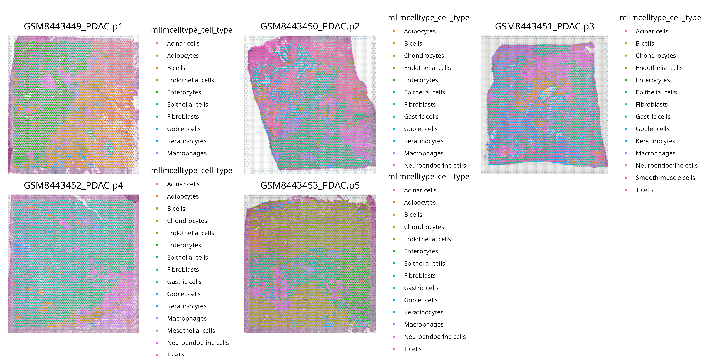

```{r, include = FALSE}
knitr::opts_chunk$set(
  collapse = TRUE,
  comment = "#>"
)
```

```{r setup}
library(SigBridgeR)
library(Seurat)
```

## Load Data

### Single Cell Transcriptomics

We will use `GSE274103` from NCBI GEO as an example. The file organization process is not described in detail here.

```{r,preprocess,eval=FALSE}
data_dir <- "GSE274103"

samples <- c(
  "GSM8443449_PDAC-p1",
  "GSM8443450_PDAC-p2",
  "GSM8443451_PDAC-p3",
  "GSM8443452_PDAC-p4",
  "GSM8443453_PDAC-p5"
)

spatial_list <- lapply(samples, function(sample) {
  seurat <- Load10X_Spatial(
    data.dir = file.path(data_dir, sample),
    slice = sample,
    assay = "Spatial"
  )

  seurat <- subset(
    seurat,
    nCount_Spatial > 0L &
      nFeature_Spatial > 0L
  )

  SCTransform(seurat, assay = "Spatial")
})

spatials <- merge(
  x = spatial_list[[1]],
  y = unlist(spatial_list[-1]),
  add.cell.ids = samples,
  merge.data = TRUE,
  project = "Integrated Spatial Seurat"
)

# DefaultAssay(spatials) <- "SCT"
VariableFeatures(spatials) <- lapply(spatial_list, function(seurat) {
  VariableFeatures(seurat)
}) %>%
  unlist() %>%
  unique()
spatials <- RunPCA(spatials) %>%
  FindNeighbors(dims = 1:30) %>%
  FindClusters() %>%
  RunUMAP(dims = 1:30)

# SeuratObject::SaveSeuratRds(spatials, "seurat.rds")
```

In theory, this workflow could be simplified using `SCPreProcess`; however, due to the performance issue reported in [Seurat #10153](https://github.com/satijalab/seurat/issues/10153)—where `SCTransform` hangs or slows down significantly when called via `do.call` (as `SCPreProcess` does internally)—we instead use a custom workflow here to avoid the slowdown.

(It hasn’t been fixed yet. If it gets resolved, please kindly notify me in the issue—thank you! :))

### Bulk RNA Seq & Survival

The bulk RNA-seq example data used here is from TCGA-PAAD. Due to copyright restrictions, it is provided solely for illustrative purposes in the vignette.

```{r,preprocess2,eval=FALSE}
bulk <- readRDS("TCGA-PAAD.rds")
#        TCGA-2J-AAB1-01 TCGA-2J-AAB4-01 TCGA-2J-AAB6-01 TCGA-2J-AAB8-01
# TSPAN6       10.336507       10.992938       10.143383        9.415742
# TNMD          0.000000        0.000000        0.000000        2.584963
# DPM1          9.967226       10.327553       10.974415        9.527477
# SCYL3         9.479780        9.481799        8.370687        9.142107
```

The corresponding TCGA survival data can be obtained from **UCSC Xena (via UCSCXenaShiny)**. And we match the corresponding samples in both the bulk RNA-seq data and the survival information.

```{r,survival,eval=FALSE}
library(UCSCXenaShiny)
tcga_surv <- load_data("tcga_surv")

paad_samples <- colnames(bulk)

tcga_paad_surv <- dplyr::filter(tcga_surv, sample %in% paad_samples) %>%
  dplyr::select(sample, OS.time, OS) %>%
  dplyr::rename(time = OS.time, status = OS) %>%
  dplyr::filter(status != "NA", time != "NA", !is.na(status), !is.na(time)) %>%
  tibble::column_to_rownames(var = "sample")

head(tcga_paad_surv)
#                 time status
# TCGA-2J-AAB1-01   66      1
# TCGA-2J-AAB4-01  729      0
# TCGA-2J-AAB6-01  293      1
# TCGA-2J-AAB8-01   80      0
# TCGA-2J-AAB9-01  627      1
# TCGA-2J-AABA-01  607      1

bulk <- bulk[, rownames(tcga_paad_surv)]
```

We will use a single-cell phenotype-based screening algorithm to identify cell populations associated with poor survival prognosis. However, to determine the identity of these cells, we first need to perform cell type annotation on the data.

## Annotation of Single Cell Data

Here we demonstrate the usage of **mLLMCelltype**. We also provide support for **SingleR** and **CellTypist** (see [https://wanglabcsu.github.io/SigBridgeR/articles/Other_Function_Details.html](https://wanglabcsu.github.io/SigBridgeR/articles/Other_Function_Details.html) for details and usage).

Here we use DeepSeek v3 only as an example. Generally speaking, the more powerful the model and the greater the number of models used, the higher the prediction accuracy of mLLMCelltype.

```{r,celltype_anno,eval=FALSE}
spatials <- Seurat::PrepSCTFindMarkers(spatials)

spatials <- SCAnnotate(
  spatials,
  models = c("deepseek-chat"),
  api_keys = list(
    deepseek = "sk-1234567890"
  )
)

# SeuratObject::SaveSeuratRds(spatials, "seurat.rds")
```

```{r,celltype_anno_output,eval=FALSE}
# ℹ [2026/02/09 11:26:14] [mLLMCelltype] Start annotating cell types
# ℹ [2026/02/09 11:26:14] Find marker genes for each clusters
# Calculating cluster 0
# Calculating cluster 1
# Calculating cluster 2
# Calculating cluster 3
# Calculating cluster 4
# Calculating cluster 5
# Calculating cluster 6
# Calculating cluster 7
# Calculating cluster 8
# Calculating cluster 9
# Calculating cluster 10
# Calculating cluster 11
# Calculating cluster 12
# Calculating cluster 13
# Calculating cluster 14
# Calculating cluster 15
# Calculating cluster 16
# Calculating cluster 17
# Calculating cluster 18
# Calculating cluster 19
# Calculating cluster 20
# Calculating cluster 21
# Calculating cluster 22
# Calculating cluster 23
# Calculating cluster 24
# ℹ [2026/02/09 11:28:42] Large language models cell type Annotating
# ###
# # LLM Output
# ###
# ✔ [2026/02/09 11:28:46] Annotation Finished
```

```{r,celltype_anno2,eval=FALSE}
table(spatials$mllmcelltype_cell_type)
```

```{r,celltype_anno_output2,eval=FALSE}
#     Acinar cells           Adipocytes              B cells         Chondrocytes    Endothelial cells
#              594                  633                 2314                  920                 2122
#      Enterocytes     Epithelial cells          Fibroblasts        Gastric cells         Goblet cells
#             2018                 4799                 3395                  547                  646
#    Keratinocytes          Macrophages    Mesothelial cells Neuroendocrine cells  Smooth muscle cells
#             1135                  879                  242                 1751                  254
#          T cells
#             1187
```

## Screen Phenotype-associated Cells

We can now run the screening. Let's try `Scissor`.

```{r,screen,eval=FALSE}
res <- Screen(
  matched_bulk = bulk,
  sc_data = spatials,
  phenotype = tcga_paad_surv,
  phenotype_class = "survival",
  screen_method = "Scissor",
  assay = "SCT"
)

# SeuratObject::SaveSeuratRds(res$scRNA_data, "screened_seurat.rds")
```

```{r,screen_output,eval=FALSE}
# ℹ `label_type` not specified or not of length 1, using "Scissor"
# ℹ [2026/02/09 15:40:19] Scissor start...
# ℹ [2026/02/09 15:40:19] Start from raw data...
# ℹ Using "SCT_snn" graph for network.
# ℹ [2026/02/09 15:40:24] Normalizing quantiles of data
# ℹ [2026/02/09 15:41:21] Subsetting data
# ℹ [2026/02/09 15:41:27] Calculating correlation
# -------------------------------------------------------------
# Five-number summary of correlations:
# 0.220832 0.388996 0.414044 0.433624 0.47267
# -------------------------------------------------------------
# ℹ [2026/02/09 15:41:39] Perform cox regression on the given clinical outcomes...
# ✔ [2026/02/09 15:42:43] Statistics data saved to Scissor_inputs.RData.
# ℹ [2026/02/09 15:42:47] Screening...

# ── At alpha = 0.05 ──

# Scissor identified 1789 Scissor+ cells and 1617 Scissor- cells.
# The percentage of selected cell is: 14.533%
# ℹ [2026/02/09 15:45:05] Scissor Ended.
```

### data

The returned structure is a `list`, where the first slot—`scRNA_data`—contains the Seurat object. Additional slots in the list store intermediate data generated during the process.

A new column named `Scissor` will be added to the `meta.data` of the Seurat object, with three possible labels:

- **Positive** denotes cells whose abundance or activity is **positively correlated** with the phenotype of interest—specifically, those associated with **poor prognosis**.  
- **Negative** denotes cells that are **negatively correlated** with the phenotype (i.e., potentially protective or associated with better outcomes).  
- **Neutral** cells can be interpreted as **background** or **non-informative** cells—those showing little to no association with the phenotype.

### files

A new file named `Scissor_inputs.RData` will be created, which contains the input data for the Scissor algorithm. You can use the intermediate data for repeated runs to save time when tuning parameters, avoiding the need to re-run the entire pipeline from scratch. This is an inherent feature of the `Scissor`.

### note

Other methods (e.g., **scAB**, **scPAS**, etc.) can also be used. In this vignette, we only introduce and apply **Scissor**. When using alternative algorithms, remember to explicitly specify `assay = "SCT"`, as these functions typically default to `assay = "RNA"`, whereas our data has been processed with `SCTransform`.

## Visualization of Screened Cells

Finally we can visualize the results. Here, we just provide a brief demonstration using Seurat's built-in visualization functions, as visualization preferences vary from user to user. If you need additional features, feel free to request them in an issue. :)

Let's first see the spatial position of the Positive cells.

```{r,viz,eval=FALSE}
positive_cell <- colnames(res$scRNA_data)[
  res$scRNA_data$scissor == "Positive"
]

p <- Seurat::SpatialDimPlot(
  res$scRNA_data,
  cells.highlight = positive_cell,
  ncol = 3L,
  image.alpha = 0.5,
  cols.highlight = c("#ff3333", "#CECECE"),
  alpha = c(0.8, 1)
) &
  ggplot2::theme(legend.position = "none")

# ggplot2::ggsave(
#   "vignettes/example_figures/spatial_dim_plot.png",
#   p,
#   width = 14,
#   height = 7
# )
```

[{fig-align="center" width="700"}]((https://github.com/WangLabCSU/SigBridgeR/blob/main/vignettes/example_figures/spatial_dim_plot.png))

To visualize the cellular composition of Positive cells:

```{r,viz2,eval=FALSE}
p2 <- Seurat::SpatialDimPlot(
  spatials,
  group.by = "mllmcelltype_cell_type",
  ncol = 3
)

# ggplot2::ggsave(
#   "vignettes/example_figures/mllmcelltype_spatial.png",
#   p2,
#   width = 14,
#   height = 7
# )
```

[{fig-align="center" width="700"}]((https://github.com/WangLabCSU/SigBridgeR/blob/main/vignettes/example_figures/mllmcelltype_spatial.png))

To statistically assess the composition of Positive cells, you can do the following:

```{r,stats,eval=FALSE}
table(res$scRNA_data$mllmcelltype_cell_type[
  res$scRNA_data$scissor == "Positive"
])
```

```{r,stats_output,eval=FALSE}
#     Acinar cells           Adipocytes              B cells         Chondrocytes    Endothelial cells
#              106                  100                   98                  566                   27
#      Enterocytes     Epithelial cells          Fibroblasts        Gastric cells         Goblet cells
#              106                  406                  319                   23                    9
#    Keratinocytes          Macrophages    Mesothelial cells Neuroendocrine cells  Smooth muscle cells
#                7                   17                    2                   43                   54
```

The proportion of Positive cells within each cell type can be calculated using the following code:

```{r,stats2,eval=FALSE}
cell_total <- table(res$scRNA_data$mllmcelltype_cell_type)
cell_positive <- table(res$scRNA_data$mllmcelltype_cell_type[
  res$scRNA_data$scissor == "Positive"
])

ratios <- cell_positive[match(names(cell_total), names(cell_positive))] /
  cell_total
ratios[is.na(ratios)] <- 0

result <- sort(round(ratios, 4), decreasing = TRUE)

result
```

```{r,stats2_output,eval=FALSE}
#     Chondrocytes  Smooth muscle cells         Acinar cells           Adipocytes          Fibroblasts
#           0.6152               0.2126               0.1785               0.1580               0.0940
# Epithelial cells          Enterocytes              B cells        Gastric cells Neuroendocrine cells
#           0.0846               0.0525               0.0424               0.0420               0.0246
#      Macrophages         Goblet cells    Endothelial cells    Mesothelial cells        Keratinocytes
#           0.0193               0.0139               0.0127               0.0083               0.0062
#          T cells
#           0.0000
```

## Sessioninfo

```{r,sessioninfo}
sessionInfo()
```